# 2020年春数据库原理课程项目报告

<p align="right">2020.06.22 Mon. 1813045 于海龙</p>

[toc]

## 一、业务需求说明

作业完成Web实现的业务为销售业务，其余需求说明简要展开。

&nbsp;&nbsp;&nbsp;&nbsp;&nbsp;&nbsp;&nbsp;&nbsp;1.  商品业务

&nbsp;&nbsp;&nbsp;&nbsp;&nbsp;&nbsp;&nbsp;&nbsp;&nbsp;&nbsp;&nbsp;&nbsp;&nbsp;&nbsp;&nbsp;&nbsp;商品种类包括但不限于电子产品、服装、工具等。 商品信息包括商品的名称、销售价格、商品描述，于进货单内包含进货价格、产地、进货时间等信息。

&nbsp;&nbsp;&nbsp;&nbsp;&nbsp;&nbsp;&nbsp;&nbsp;2. 进货业务

&nbsp;&nbsp;&nbsp;&nbsp;&nbsp;&nbsp;&nbsp;&nbsp;&nbsp;&nbsp;&nbsp;&nbsp;&nbsp;&nbsp;&nbsp;&nbsp;每一笔进货业务拥有进货单，可以包含多个商品进货的详细信息。包含了提供商、进货员、进货价格与时间等信息。拥有不同的进货状态。可以查询商品的进货情况并统计月进货数据。

&nbsp;&nbsp;&nbsp;&nbsp;&nbsp;&nbsp;&nbsp;&nbsp;3. 销售业务

&nbsp;&nbsp;&nbsp;&nbsp;&nbsp;&nbsp;&nbsp;&nbsp;&nbsp;&nbsp;&nbsp;&nbsp;&nbsp;&nbsp;&nbsp;&nbsp;每一笔销售业务具有订单和订单内若干商品的具体订单详细信息。消费者可以查询订单状态并对不同状态下的订单进行不同的操作，例如订单的草拟、取消、执行、完成、退换等。用户可以查询不同类别商品的销售情况、热门冷门商品等，也可以查询商品的实时库存。

&nbsp;&nbsp;&nbsp;&nbsp;&nbsp;&nbsp;&nbsp;&nbsp;4. 财务管理

&nbsp;&nbsp;&nbsp;&nbsp;&nbsp;&nbsp;&nbsp;&nbsp;&nbsp;&nbsp;&nbsp;&nbsp;&nbsp;&nbsp;&nbsp;&nbsp;可以通过数据库统计每日、每月的销售额、盈利额、统计销售员的销售额。

&nbsp;&nbsp;&nbsp;&nbsp;&nbsp;&nbsp;&nbsp;&nbsp;5. 关于客户

&nbsp;&nbsp;&nbsp;&nbsp;&nbsp;&nbsp;&nbsp;&nbsp;&nbsp;&nbsp;&nbsp;&nbsp;&nbsp;&nbsp;&nbsp;&nbsp;存储客户的基本信息，包括但不限于姓名、昵称、性别、地区、电子邮箱、电话号码、余额和购物兴趣等。可以查询商品的销售价格。


## 二、项目E－R图

&nbsp;&nbsp;&nbsp;&nbsp;&nbsp;&nbsp;&nbsp;&nbsp;以下为项目的E－R图截图，在附件中，MySQL Workbench项目存储在SQL文件夹下 “Mail.mwb”文件中，对应的截图存储于Picture文件夹和SQL文件夹下。


## 三、设计模式与说明

&nbsp;&nbsp;&nbsp;&nbsp;&nbsp;&nbsp;&nbsp;&nbsp;在数据库设计中，Customer表和Goods表为核心部分，数据库设计围绕这两个部分展开。

​		Customer表与Customer_Telephone表、Customer_Interest表、Customer_Address表、Customer_Order表和Customer_Shopping_Cart表均为一对多的关系，添加Customer_ID为外键，Customer_Telephone表以不允许重复的电话号码为主键，Customer_Shopping_Cart表以Customer_ID和Goods_ID为联合主键（同商品则修改对应记录下的Goods_Number而不会增加新的数据库记录），Customer_Interest采用Customer_ID和Goods_Type为联合主键，其余采用自增ID作为主键。

&nbsp;&nbsp;&nbsp;&nbsp;&nbsp;&nbsp;&nbsp;&nbsp;而对于Goods表，Goods表以Goods_Type表Goods_Type和Shop表的Shop_ID为外键，Owner表对于Shop表、Shop表对Goods、Goods_Type对Goods表均为一对多的关系。而Goods表对于Shopping_Cart表、Shop_Purchase_Detial表和Remark表均为一对多关系。进货单、订单、店铺、商品、人员均设置自增ID为其主键。

​		其中Web应用涉及的表包括：Customer表、Customer_Order表、Order_Detial表、Shopping_Cart表、Goods_Type表、Goods表、Shop表、Seller表、Customer_Telephone表。

​		数据库表单对应信息详见下表。

​		附录1存储了关于表单和各字段的详细信息。

​		附录2存储了关于设计中订单状态的内容。

| 表名              | 内容         | 表名               | 内容         |
| ----------------- | ------------ | ------------------ | ------------ |
| Customer          | 用户信息表   | Customer_Telephone | 用户电话表   |
| Customer_Interest | 用户喜好表   | Customer_Address   | 用户地址表   |
| Coupon            | 优惠券表     | Coupon_Detial      | 用户优惠券表 |
| Customer_Order    | 用户订单表   | Order_Detial       | 订单详情表   |
| Shopping_Cart     | 购物车表     | Goods_Type         | 商品类别表   |
| Seller            | 销售员信息表 | Goods              | 商品信息表   |
| Remark            | 评论表       | Shop               | 商店信息表   |
| Shop_Purchase     | 商店进货表   | Purchase_Detial    | 进货单详情表 |
| Owner             | 商店所有者表 | Purchaser          | 进货员信息表 |


## 四、数据库设计方案、场景相关说明

### 1. 完整性约束

&nbsp;&nbsp;&nbsp;&nbsp;&nbsp;&nbsp;&nbsp;&nbsp;所有表的每一行均是唯一确定的实体，满足实体完整性。对于数据库而言，其中的例如地址、商品详情的信息只要求非空，或者电话号码只要求了非空非重复，需要在应用层面进行例如正则表达式等手段进行约束；对于ID序号、金额和库存的信息，限制其为unsigned数并限制涉及财务内容为两位小数的12位数字。使用外键参考的内容，进行了外键约束保证内容的一致性，而对于订单的历史价格除外，历史订单的价格信息不会同商品价格一起变化，历史价格也没有参考商品的外键，在应用层面进行处理。


### 2. 范式理论

&nbsp;&nbsp;&nbsp;&nbsp;&nbsp;&nbsp;&nbsp;&nbsp;所有的表每一项均满足不可分割的原子项，即满足第一范式。所有表中均不存在对于非主属性的部分依赖，即满足第二范式。在所有的表中没有非主属性的传递依赖，故满足第三范式。对于巴斯范式标准而言，在所有的表中：以自增ID为主键的表ID，可以唯一确定其他属性，而且在数据库设计中以自增ID为主键的表没有其他候选码，这些表符合巴斯范式；对于使用联合主键的表来说，联合主键可以唯一确定其他属性，不包含其他的候选码可以确定其他属性（Remark表会因为对同一详细订单的追加评论而导致详细订单ID不能唯一确定一条评论），这些表符合巴斯范式。


### 3. 视图

&nbsp;&nbsp;&nbsp;&nbsp;&nbsp;&nbsp;&nbsp;在实现的项目原型内，用户查看的商品信息和订单详细信息就是通过视图查询得到的，订单的详细信息存在于不同的表内，通过视图查询可以合并这些数据，减少应用层的查询次数。而在未实现的商家管理系统中，使用类似的订单视图可以确保用户的重要信息不会被展示给商家，也不会面临被修改的问题。

```SQL
create view Goods_Display (goods_id, goods_name, goods_type, goods_price, goods_information, shop_name, goods_number) as select goods_id, goods_name, goods_type, goods_price, goods_information, shop_name, goods_number from goods, shop where goods.goods_shop_id=shop.shop_id;

create view Orders (order_id, goods_id , goods_name, goods_type, goods_price, goods_number, price, seller_name, time) as select order_detial_customer_order_id, order_detial_goods_id, goods_name, goods_type, order_detial_price, order_detial_number, order_detial_price*order_detial_number, seller_name, order_detial_time from order_detial, goods, seller where order_detial.order_detial_goods_id=goods.goods_id and order_detial.order_detial_seller_id=seller.seller_id;
```


### 4. 触发器

&nbsp;&nbsp;&nbsp;&nbsp;&nbsp;&nbsp;&nbsp;&nbsp;&nbsp;在实现的项目原型内，当用户对订单进行取消或退还操作时，触发器会在更新订单状态之后修改订单每个商品的状态，可以简化应用层业务的操作。但是触发器可移植性差，如果逻辑复杂的话占用服务器资源比较多。

```SQL
delimiter //
drop trigger if exists updateOrderStatus;
create trigger `updateOrderStatus` after update on `customer_order` for each row
begin
	update order_detial set order_detial_status=NEW.`customer_order_status` where order_detial_customer_order_id=OLD.`customer_order_id`;
end //
delimiter ;
```


### 5. 存储过程

&nbsp;&nbsp;&nbsp;&nbsp;&nbsp;&nbsp;&nbsp;&nbsp;在实现的项目原型内，输出一月内、一周内商品销售榜单采用了调用存储过程的方法，可以简化后端对于销量统计的查询操作。存储过程是预编译的，速度快，封装性好，增强安全性，但是存储过程的可移植性差，对于不同数据库迁移来说不方便，甚至对于某些数据库不可用。

```SQL
drop procedure if exists viewSaleListWeek;
delimiter //
create procedure viewSaleListWeek()
begin
	drop table if exists saleList;
	create temporary table saleList(number int unsigned not null, id int unsigned not null primary key, name varchar(45) not null);
	drop table if exists typeList;
	create temporary table typeList(number int unsigned not null, type varchar(45) not null primary key);
	insert into saleList select sum(order_detial_number),order_detial_goods_id, goods_name from order_detial, goods where order_detial_status='F' and order_detial_time>date_sub(now(),interval 7 Day) and goods.goods_id=order_detial.order_detial_goods_id group by order_detial_goods_id limit 10;
	insert into typeList select sum(number), goods_type from saleList, goods where saleList.id=goods.goods_id group by goods_type limit 10;
end //
delimiter ;


drop procedure if exists viewSaleListMonth;
delimiter //
create procedure viewSaleListMonth()
begin
	drop table if exists saleList;
	create temporary table saleList(number int unsigned not null, id int unsigned not null primary key, name varchar(45) not null);
	drop table if exists typeList;
	create temporary table typeList(number int unsigned not null, type varchar(45) not null primary key);
	insert into saleList select sum(order_detial_number),order_detial_goods_id, goods_name from order_detial, goods where order_detial_status='F' and  order_detial_time>date_sub(now(),interval 1 Month) and goods.goods_id=order_detial.order_detial_goods_id group by order_detial_goods_id limit 10;
	insert into typeList select sum(number), goods_type from saleList, goods where saleList.id=goods.goods_id group by goods_type limit 10;
end //
delimiter ;

```


### 6. 事务处理

&nbsp;&nbsp;&nbsp;&nbsp;&nbsp;&nbsp;&nbsp;&nbsp;对于订单的结算、收货、退货等操作，需要考虑并发的事务处理。在结算等操作之前开启事务，执行全部验证商品的库存和用户金额的操作，在验证完成并进行相应的处理后提交事务，如果事务出现问题则进行事务的回滚，恢复到未执行前的状态。采用事务处理以确保数据的正确性，保持数据的完整性一致性。


## 五、数据库脚本

&nbsp;&nbsp;&nbsp;&nbsp;&nbsp;&nbsp;&nbsp;&nbsp;附录3为由创建的工程自动生成的数据库生成脚本，在附件中，存储在SQL文件夹下“DatabaseSQL.sql”文件中。执行该代码会创建数据库”Mail“和对应的18张表。而在执行Web项目样例之前还需要执行SQL文件夹下初始化脚本”init.sql“（附录4）以便增加用户的商品等数据内容并创建视图等。


## 六、设计方案逻辑与优化

### &nbsp;&nbsp;&nbsp;&nbsp;&nbsp;&nbsp;&nbsp;&nbsp;1. 提高查询性能

&nbsp;&nbsp;&nbsp;&nbsp;&nbsp;&nbsp;&nbsp;&nbsp;采用左连接等代替where等方法查询以提高数据库的查询效率，例如在Web实现中的冷门商品查询过程中使用的左连接查询。或者在更多的业务逻辑中采用视图查询的方法合并查询多张不需要修改的数据表减少多次查询带来的时间成本。


### &nbsp;&nbsp;&nbsp;&nbsp;&nbsp;&nbsp;&nbsp;&nbsp;2. 提高数据库安全

&nbsp;&nbsp;&nbsp;&nbsp;&nbsp;&nbsp;&nbsp;&nbsp;在实现的Web原型中采用了PyMySQL执行的绑定变量的方式，一定程度上方式SQL注入问题，提高数据库安全。在客户端内容输入时，采用正则表达式等方法验证数据的合法性，也可以有效提高数据库的安全系数。使用更多的选择代替文字输入以避免数据库的恶意注入。使用视图查询修改用户权限，为不同的表对不同的用户创建不同的读写权限。

### &nbsp;&nbsp;&nbsp;&nbsp;&nbsp;&nbsp;&nbsp;&nbsp;3. 多个销售退货业务实现逻辑

&nbsp;&nbsp;&nbsp;&nbsp;&nbsp;&nbsp;&nbsp;&nbsp;在销售和退货的结算代码部分采用事务处理。当用户下单后，直至确认订单前，除对于购物车进行相应操作和用户订单草拟外不做任何操作。当用户确认订单时，首先启动事务，检查用户订单中的商品存货是否大于等于购买量，检查用户的资金是否大于等于购买的金额，检查完毕后扣除金额和库存数量，此时资金并不会直接转至商店，订单转至运行状态，事务提交。当订单到达运行状态，用户可以确认收货或者取消，如果取消，启动事务，则会将资金返还给用户，库存返还至商店，事务提交；如果收货则资金进入商家账户。当订单完成后，用户可以选择换货或退货，如果换货，则订单转至换货状态；退货则转至退货状态，启动事务，商家的库存增加对应退货的数量，资金减少相应的金额，用户资金增加相应的金额，事务提交。


## 七、Web项目样例

&nbsp;&nbsp;&nbsp;&nbsp;&nbsp;&nbsp;&nbsp;&nbsp;Web实现的原型为销售业务，用户可以在登录后对商品进行加入购物车、购买、退换、查看榜单等操作。Django项目文件位于Django文件夹下，在执行前需要提前执行 “DatabseSQL.sql” 和 "init.sql" 两个文件，以下为具体的操作样例。

&nbsp;&nbsp;&nbsp;&nbsp;&nbsp;&nbsp;&nbsp;&nbsp;首先是未登录状态下的在线商城主页：


&nbsp;&nbsp;&nbsp;&nbsp;&nbsp;&nbsp;&nbsp;&nbsp;在实现的Web原型部分可以选择当前已经初始化过的账号进行登录，账号1，密码Pual，余额100；账号2，密码Jackson，余额10000。以下为登录账号1后的在线商城主页：


&nbsp;&nbsp;&nbsp;&nbsp;&nbsp;&nbsp;&nbsp;&nbsp;在登录状态下我们可以对商品进行加入购物车或者直接购买的操作，可以查看购物车的详细内容、之前订单的详细内容或者是退出登录。


&nbsp;&nbsp;&nbsp;&nbsp;&nbsp;&nbsp;&nbsp;&nbsp;在主页上搜索商品名：

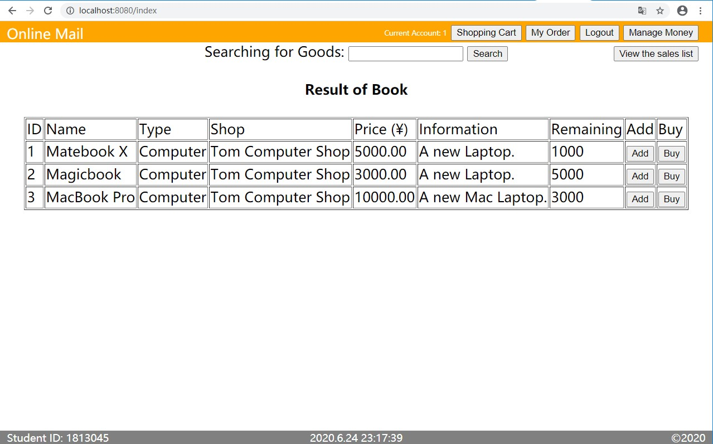


&nbsp;&nbsp;&nbsp;&nbsp;&nbsp;&nbsp;&nbsp;&nbsp;在网页上添加商品到购物车后：（购物车在初始化后为空，网页提示空的购物车）

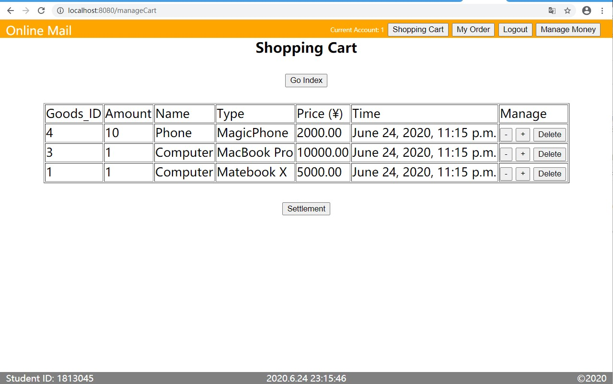


&nbsp;&nbsp;&nbsp;&nbsp;&nbsp;&nbsp;&nbsp;&nbsp;订单（初始化内容）：

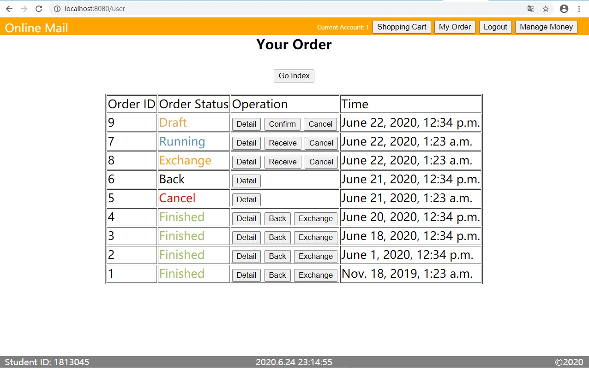


&nbsp;&nbsp;&nbsp;&nbsp;&nbsp;&nbsp;&nbsp;&nbsp;查看订单详情（初始化内容）：

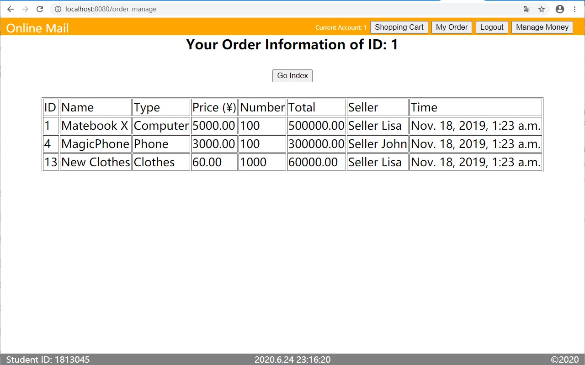


&nbsp;&nbsp;&nbsp;&nbsp;&nbsp;&nbsp;&nbsp;&nbsp;资金管理：

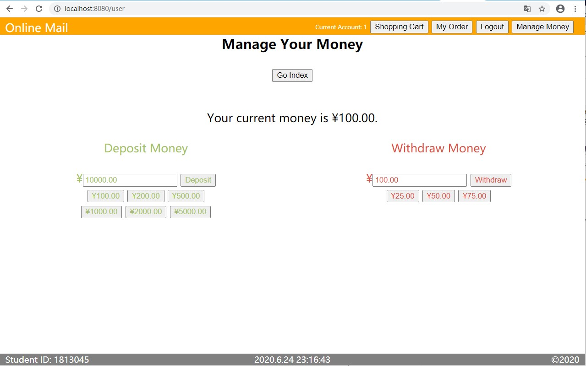


&nbsp;&nbsp;&nbsp;&nbsp;&nbsp;&nbsp;&nbsp;&nbsp;商品榜单（初始化内容）：


&nbsp;&nbsp;&nbsp;&nbsp;&nbsp;&nbsp;&nbsp;&nbsp;注册一个新的账号：

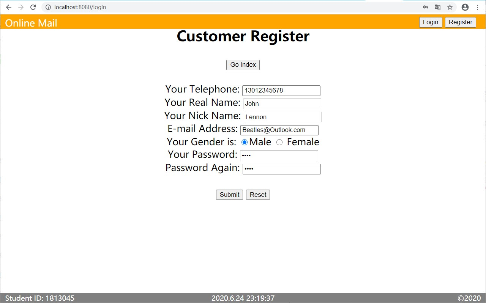

&nbsp;&nbsp;&nbsp;&nbsp;&nbsp;&nbsp;&nbsp;&nbsp;注册成功，登录：

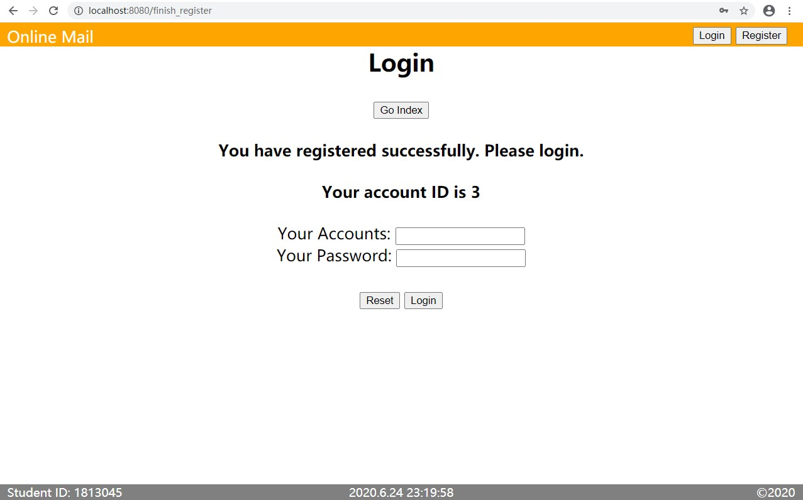


&nbsp;&nbsp;&nbsp;&nbsp;&nbsp;&nbsp;&nbsp;&nbsp;其他情况说明：

​		存款取款对应提示：

<center>
    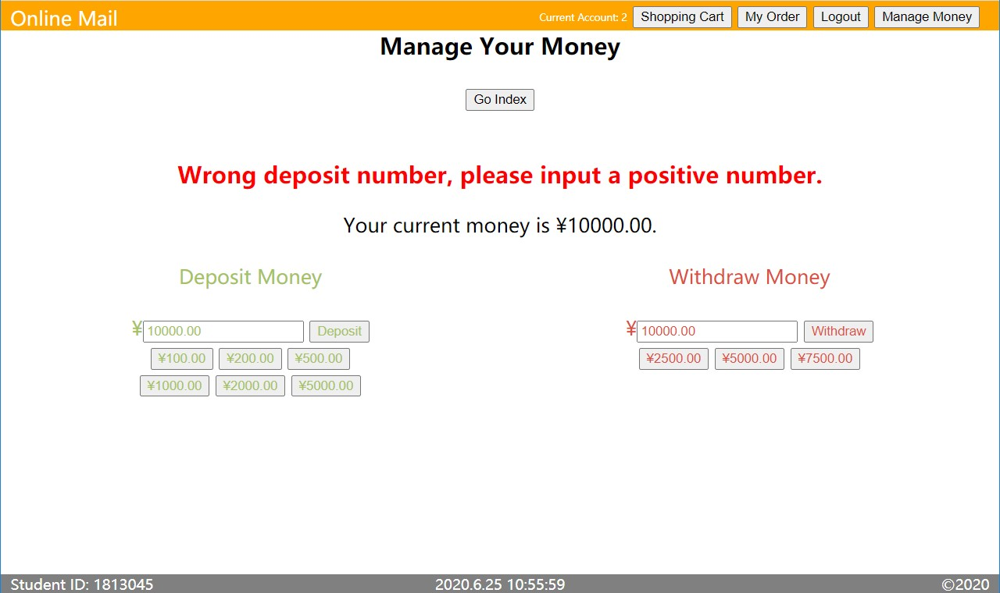
    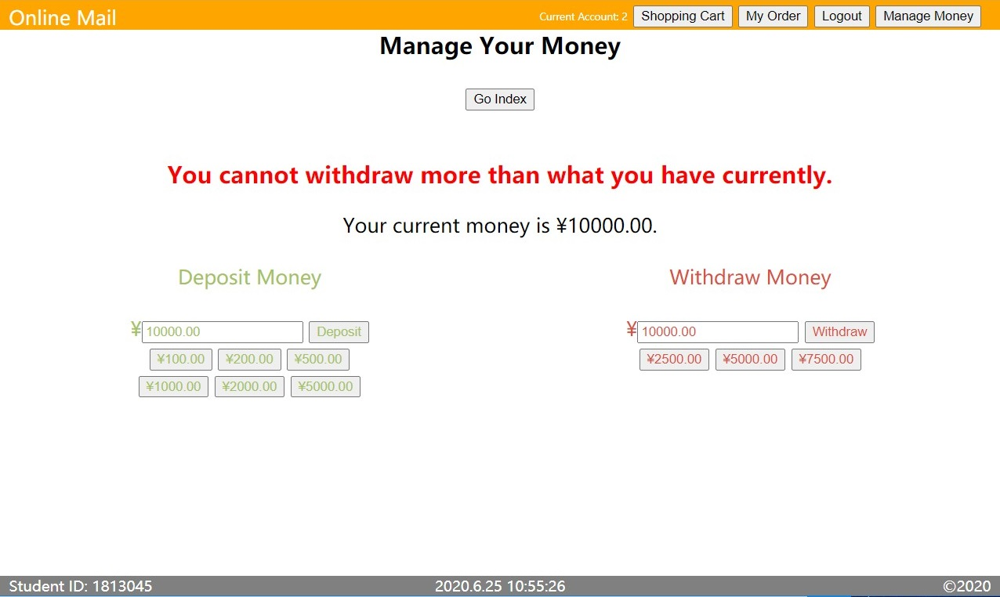
</center>

​		注册登录提示：

<center>
    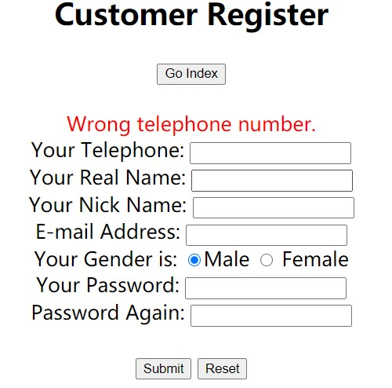
    
</center>

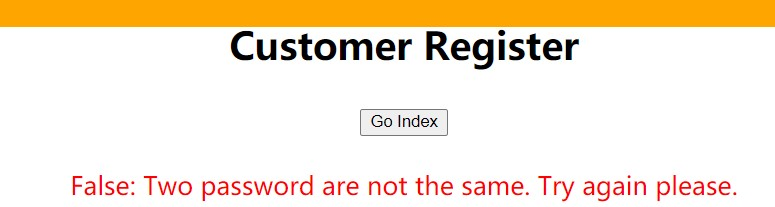


​		订单库存余额提示：

<center>
    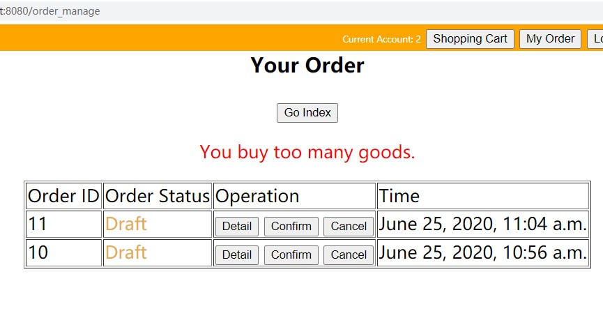
    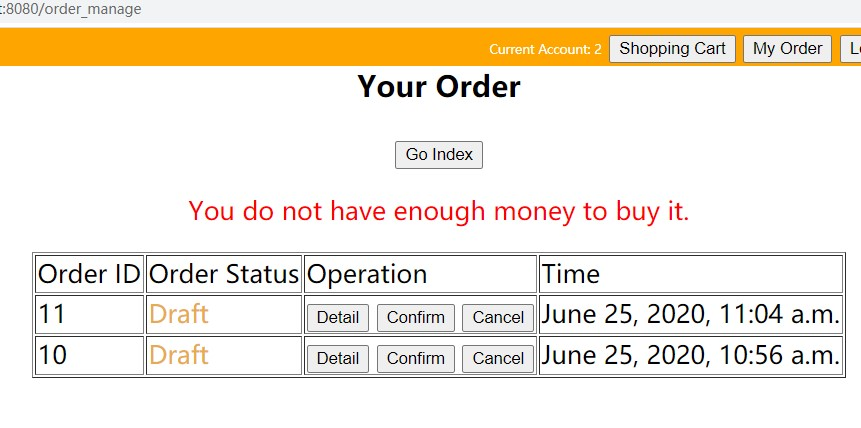
</center>


## 八、特点和其他解决方案

​		采用视图、正则表达式等方法对Web应用查询和插入数据库数据进行优化，页面逻辑相对完整。

&nbsp;&nbsp;&nbsp;&nbsp;&nbsp;&nbsp;&nbsp;&nbsp;对于多家企业提供的解决方案，如果对应的商户数量少、商品种类较少并且允许同时被搜索的话，可以对于不同的企业下的Owner、Seller和Purchaser添加新的属性，指定他们对应的公司，外键参考一张新的公司表；如果不允许同时搜索，则可以对于所有的搜索操作建立新的按照不同企业划分的视图，将数据分离。如果对应的商户多，商品种类多并且不允许被同时搜索，则可以将不同的企业分置于不同的数据库下。


## 附录

1. 数据库表详细信息说明

   （所有INT数据类型均为Unsigned类型）

   __Customer表：__用户表

&nbsp;&nbsp;&nbsp;&nbsp;&nbsp;&nbsp;&nbsp;&nbsp;Customer_ID INT 自增的用户ID 主键

&nbsp;&nbsp;&nbsp;&nbsp;&nbsp;&nbsp;&nbsp;&nbsp;Customer_Name Varchar(45) 用户名

&nbsp;&nbsp;&nbsp;&nbsp;&nbsp;&nbsp;&nbsp;&nbsp;Customer_Nick_name Varchar(45) 用户昵称

&nbsp;&nbsp;&nbsp;&nbsp;&nbsp;&nbsp;&nbsp;&nbsp;Customer_Email Varchar(45) 用户电子邮箱

&nbsp;&nbsp;&nbsp;&nbsp;&nbsp;&nbsp;&nbsp;&nbsp;Customer_Gender Varchar(6) 用户性别

&nbsp;&nbsp;&nbsp;&nbsp;&nbsp;&nbsp;&nbsp;&nbsp;Customer_Password Varchar(32) md5录入的加密后的用户密码

&nbsp;&nbsp;&nbsp;&nbsp;&nbsp;&nbsp;&nbsp;&nbsp;Customer_Funds Decimal(12,2) 用户资金

&nbsp;&nbsp;&nbsp;&nbsp;&nbsp;&nbsp;&nbsp;&nbsp;Customer_Register_Time DateTime 用户注册时间

&nbsp;&nbsp;&nbsp;&nbsp;&nbsp;&nbsp;&nbsp;&nbsp;__Customer_Telephone表：__用户电话表

&nbsp;&nbsp;&nbsp;&nbsp;&nbsp;&nbsp;&nbsp;&nbsp;Customer_Telephone Varchar(18) 用户电话号码 主键

&nbsp;&nbsp;&nbsp;&nbsp;&nbsp;&nbsp;&nbsp;&nbsp;Customer_Customer_ID 用户ID 外键

&nbsp;&nbsp;&nbsp;&nbsp;&nbsp;&nbsp;&nbsp;&nbsp;__Customer_Interest表：__用户喜好表

&nbsp;&nbsp;&nbsp;&nbsp;&nbsp;&nbsp;&nbsp;&nbsp;Customer_Interest_Customer_ID INT 用户ID 外键 联合主键

&nbsp;&nbsp;&nbsp;&nbsp;&nbsp;&nbsp;&nbsp;&nbsp;Customer_Interest_Goods_type Varchar(45) 商品类别 外键 联合主键

&nbsp;&nbsp;&nbsp;&nbsp;&nbsp;&nbsp;&nbsp;&nbsp;__Customer_Address表：__用户地址表

&nbsp;&nbsp;&nbsp;&nbsp;&nbsp;&nbsp;&nbsp;&nbsp;Customer_Address_ID INT 自增的用户地址ID 主键

&nbsp;&nbsp;&nbsp;&nbsp;&nbsp;&nbsp;&nbsp;&nbsp;Customer_Address_Customer_ID INT 用户ID 外键

&nbsp;&nbsp;&nbsp;&nbsp;&nbsp;&nbsp;&nbsp;&nbsp;Customer_Address_Province Varchar(45) 省

&nbsp;&nbsp;&nbsp;&nbsp;&nbsp;&nbsp;&nbsp;&nbsp;Customer_Address_City Varchar(45) 市

&nbsp;&nbsp;&nbsp;&nbsp;&nbsp;&nbsp;&nbsp;&nbsp;Customer_Address_Detial Varchar(45) 详细地址

&nbsp;&nbsp;&nbsp;&nbsp;&nbsp;&nbsp;&nbsp;&nbsp;__Coupon_Detial表：__用户优惠券表

&nbsp;&nbsp;&nbsp;&nbsp;&nbsp;&nbsp;&nbsp;&nbsp;Coupon_Detial_Coupon_ID INT 优惠券ID 外键 联合主键

&nbsp;&nbsp;&nbsp;&nbsp;&nbsp;&nbsp;&nbsp;&nbsp;Custom_Detial_Custom_ID INT 用户ID 外键 联合主键

&nbsp;&nbsp;&nbsp;&nbsp;&nbsp;&nbsp;&nbsp;&nbsp;Coupon_Detial_status Varchar(45) 优惠券使用状态

&nbsp;&nbsp;&nbsp;&nbsp;&nbsp;&nbsp;&nbsp;&nbsp;__Coupon表：__优惠券表

&nbsp;&nbsp;&nbsp;&nbsp;&nbsp;&nbsp;&nbsp;&nbsp;Coupon_ID INT 自增的优惠券ID 主键

&nbsp;&nbsp;&nbsp;&nbsp;&nbsp;&nbsp;&nbsp;&nbsp;Coupon_Number INT 优惠券数量

&nbsp;&nbsp;&nbsp;&nbsp;&nbsp;&nbsp;&nbsp;&nbsp;Coupon_Price Decimal(8,2) 优惠券面值

&nbsp;&nbsp;&nbsp;&nbsp;&nbsp;&nbsp;&nbsp;&nbsp;__Customer_Order表：__用户订单表

&nbsp;&nbsp;&nbsp;&nbsp;&nbsp;&nbsp;&nbsp;&nbsp;Customer_Order_ID INT 自增的用户订单ID 主键

&nbsp;&nbsp;&nbsp;&nbsp;&nbsp;&nbsp;&nbsp;&nbsp;Customer_Order_Customer_ID INT 用户ID 外键

&nbsp;&nbsp;&nbsp;&nbsp;&nbsp;&nbsp;&nbsp;&nbsp;Customer_Order_Status Varchar(1) 订单状态 

&nbsp;&nbsp;&nbsp;&nbsp;&nbsp;&nbsp;&nbsp;&nbsp;Customer_Order_Time DateTime 订单创建时间

&nbsp;&nbsp;&nbsp;&nbsp;&nbsp;&nbsp;&nbsp;&nbsp;__Order_Detial表：__订单细节表

&nbsp;&nbsp;&nbsp;&nbsp;&nbsp;&nbsp;&nbsp;&nbsp;Order_Detial_customer_Order_ID INT 用户订单ID 外键 联合主键

&nbsp;&nbsp;&nbsp;&nbsp;&nbsp;&nbsp;&nbsp;&nbsp;Order_Detial_Goods_ID INT 商品ID 外键 联合主键

&nbsp;&nbsp;&nbsp;&nbsp;&nbsp;&nbsp;&nbsp;&nbsp;Order_Detial_Seller_ID INT 售货员ID 外键

&nbsp;&nbsp;&nbsp;&nbsp;&nbsp;&nbsp;&nbsp;&nbsp;Order_Detial_Price Decimal(12,2) 商品售价

&nbsp;&nbsp;&nbsp;&nbsp;&nbsp;&nbsp;&nbsp;&nbsp;Order_Detial_Number INT 商品数量

&nbsp;&nbsp;&nbsp;&nbsp;&nbsp;&nbsp;&nbsp;&nbsp;Order_Detial_Status Varchar(1) 详细订单状态

&nbsp;&nbsp;&nbsp;&nbsp;&nbsp;&nbsp;&nbsp;&nbsp;Order_Detial_Time DateTime 详细订单时间

&nbsp;&nbsp;&nbsp;&nbsp;&nbsp;&nbsp;&nbsp;&nbsp;__Shopping_Cart表：__购物车表

&nbsp;&nbsp;&nbsp;&nbsp;&nbsp;&nbsp;&nbsp;&nbsp;Shopping_Cart_Customer_ID INT 用户ID 外键 联合主键

&nbsp;&nbsp;&nbsp;&nbsp;&nbsp;&nbsp;&nbsp;&nbsp;Shopping_Cart_Goods_ID INT 商品ID 外键 联合主键

&nbsp;&nbsp;&nbsp;&nbsp;&nbsp;&nbsp;&nbsp;&nbsp;Shopping_Cart_Time DateTime 加入购物车时间

&nbsp;&nbsp;&nbsp;&nbsp;&nbsp;&nbsp;&nbsp;&nbsp;Shopping_Cart_Goods_Number INT 加入购物车的商品数目

&nbsp;&nbsp;&nbsp;&nbsp;&nbsp;&nbsp;&nbsp;&nbsp;__Seller表：__销售员信息表

&nbsp;&nbsp;&nbsp;&nbsp;&nbsp;&nbsp;&nbsp;&nbsp;Seller_ID INT 自增的销售员ID 主键

&nbsp;&nbsp;&nbsp;&nbsp;&nbsp;&nbsp;&nbsp;&nbsp;Seller_Name Varchar(45) 销售员名称

&nbsp;&nbsp;&nbsp;&nbsp;&nbsp;&nbsp;&nbsp;&nbsp;__Goods_Type表：__商品类别表

&nbsp;&nbsp;&nbsp;&nbsp;&nbsp;&nbsp;&nbsp;&nbsp;Goods_Type Varchar(45) 商品类别 主键

&nbsp;&nbsp;&nbsp;&nbsp;&nbsp;&nbsp;&nbsp;&nbsp;__Goods表：__商品信息表

&nbsp;&nbsp;&nbsp;&nbsp;&nbsp;&nbsp;&nbsp;&nbsp;Goods_ID INT 自增的商品ID 主键

&nbsp;&nbsp;&nbsp;&nbsp;&nbsp;&nbsp;&nbsp;&nbsp;Goods_Type Varchar(45) 商品类别 外键

&nbsp;&nbsp;&nbsp;&nbsp;&nbsp;&nbsp;&nbsp;&nbsp;Goods_Shop_ID INT 商品所属商店ID 外键

&nbsp;&nbsp;&nbsp;&nbsp;&nbsp;&nbsp;&nbsp;&nbsp;Goods_Price Decimal(12,2) 商品销售价格

&nbsp;&nbsp;&nbsp;&nbsp;&nbsp;&nbsp;&nbsp;&nbsp;Goods_Name Varchar(45) 商品名称

&nbsp;&nbsp;&nbsp;&nbsp;&nbsp;&nbsp;&nbsp;&nbsp;Goods_Information Varchar(45) 商品详细信息

&nbsp;&nbsp;&nbsp;&nbsp;&nbsp;&nbsp;&nbsp;&nbsp;Goods_Number INT 商品库存

&nbsp;&nbsp;&nbsp;&nbsp;&nbsp;&nbsp;&nbsp;&nbsp;__Remark表：__评论表

&nbsp;&nbsp;&nbsp;&nbsp;&nbsp;&nbsp;&nbsp;&nbsp;Remark_ID INT 自增的评论ID 主键

&nbsp;&nbsp;&nbsp;&nbsp;&nbsp;&nbsp;&nbsp;&nbsp;Remark_Detial_Order_ID INT 详细订单订单号 外键

&nbsp;&nbsp;&nbsp;&nbsp;&nbsp;&nbsp;&nbsp;&nbsp;Remark_Status Varchar(1) 评论状态

&nbsp;&nbsp;&nbsp;&nbsp;&nbsp;&nbsp;&nbsp;&nbsp;Remark_Anonymous Varchar(1) 评论的匿名状态

&nbsp;&nbsp;&nbsp;&nbsp;&nbsp;&nbsp;&nbsp;&nbsp;__Shop表：__商店信息表

&nbsp;&nbsp;&nbsp;&nbsp;&nbsp;&nbsp;&nbsp;&nbsp;Shop_ID INT 自增的商店ID 主键

&nbsp;&nbsp;&nbsp;&nbsp;&nbsp;&nbsp;&nbsp;&nbsp;Shop_Name Varchar(45) 商店名称

&nbsp;&nbsp;&nbsp;&nbsp;&nbsp;&nbsp;&nbsp;&nbsp;Shop_Owner_ID INT 商店所有者 外键

&nbsp;&nbsp;&nbsp;&nbsp;&nbsp;&nbsp;&nbsp;&nbsp;Shop_Funds Decimal(12,2) 商店资金

&nbsp;&nbsp;&nbsp;&nbsp;&nbsp;&nbsp;&nbsp;&nbsp;__Shop_Purchase表：__商店进货单表

&nbsp;&nbsp;&nbsp;&nbsp;&nbsp;&nbsp;&nbsp;&nbsp;Shop_Purchase_ID INT 自增的进货单ID 主键

&nbsp;&nbsp;&nbsp;&nbsp;&nbsp;&nbsp;&nbsp;&nbsp;Shop_Purchase_Shop_ID INT 进货的商店ID 外键

&nbsp;&nbsp;&nbsp;&nbsp;&nbsp;&nbsp;&nbsp;&nbsp;Shop_Purchase_Time DateTime 进货单创建时间

&nbsp;&nbsp;&nbsp;&nbsp;&nbsp;&nbsp;&nbsp;&nbsp;Shop_Purchas_status Varchar(1) 进货单状态

&nbsp;&nbsp;&nbsp;&nbsp;&nbsp;&nbsp;&nbsp;&nbsp;__Purchase_Detial表：__详细进货单表

&nbsp;&nbsp;&nbsp;&nbsp;&nbsp;&nbsp;&nbsp;&nbsp;Shop_Purchase_Goods_ID INT 详细进货单对应商品ID 外键 联合主键

&nbsp;&nbsp;&nbsp;&nbsp;&nbsp;&nbsp;&nbsp;&nbsp;Shop_Purchase_Shop_Purchase_ID INT 详细进货单对应进货单ID 外键 联合主键

&nbsp;&nbsp;&nbsp;&nbsp;&nbsp;&nbsp;&nbsp;&nbsp;Shop_Purchase_Purchaser_ID INT 进货员ID 外键

&nbsp;&nbsp;&nbsp;&nbsp;&nbsp;&nbsp;&nbsp;&nbsp;Shop_Purchase_Detial_Number INT 商品数量

&nbsp;&nbsp;&nbsp;&nbsp;&nbsp;&nbsp;&nbsp;&nbsp;Shop_Purchase_Detial_Price Decimal(12,2) 商品进货价格

&nbsp;&nbsp;&nbsp;&nbsp;&nbsp;&nbsp;&nbsp;&nbsp;Shop_Purchase_Detial_Status Varchar(1) 详细进货单状态

&nbsp;&nbsp;&nbsp;&nbsp;&nbsp;&nbsp;&nbsp;&nbsp;Shop_Purchase_Detial_Time DateTime 详细进货单时间

&nbsp;&nbsp;&nbsp;&nbsp;&nbsp;&nbsp;&nbsp;&nbsp;__Owner表：__商店所有者信息表 

&nbsp;&nbsp;&nbsp;&nbsp;&nbsp;&nbsp;&nbsp;&nbsp;Owner_ID INT 自增的商店所有者ID 主键

&nbsp;&nbsp;&nbsp;&nbsp;&nbsp;&nbsp;&nbsp;&nbsp;Owner_Name Varchar(45) 所有者姓名

&nbsp;&nbsp;&nbsp;&nbsp;&nbsp;&nbsp;&nbsp;&nbsp;Owner_Funds Decimal(12,2) 所有者资金

&nbsp;&nbsp;&nbsp;&nbsp;&nbsp;&nbsp;&nbsp;&nbsp;__Purchaser表：__进货员信息表

&nbsp;&nbsp;&nbsp;&nbsp;&nbsp;&nbsp;&nbsp;&nbsp;Purchaser_ID INT 自增的进货员ID 主键

&nbsp;&nbsp;&nbsp;&nbsp;&nbsp;&nbsp;&nbsp;&nbsp;Purchaser_Name Varchar(45) 进货员姓名


2. 订单状态说明

   ```
   草拟 Draft D 对于订单而言草拟不会进行真实的购买操作，确认后扣款并减少库存。
   取消 Cancel C 订单的取消，对于执行中的的订单会退款并补回库存。
   执行 Running R 草拟订单确认后会转变为执行状态。
   完成 Finished F 执行或换货状态确认收货即完成订单，钱款进入商店账户。
   换货 Exchange E 收货后可以换货，不对库存进行操作。
   退货 Back B 收货后可以退货，同时退款并补回库存。
   ```

   <br><br><br>

3.  前向工程生成的代码

   ```SQL
   -- MySQL Workbench Forward Engineering
   
   SET @OLD_UNIQUE_CHECKS=@@UNIQUE_CHECKS, UNIQUE_CHECKS=0;
   SET @OLD_FOREIGN_KEY_CHECKS=@@FOREIGN_KEY_CHECKS, FOREIGN_KEY_CHECKS=0;
   SET @OLD_SQL_MODE=@@SQL_MODE, SQL_MODE='ONLY_FULL_GROUP_BY,STRICT_TRANS_TABLES,NO_ZERO_IN_DATE,NO_ZERO_DATE,ERROR_FOR_DIVISION_BY_ZERO,NO_ENGINE_SUBSTITUTION';
   
   -- -----------------------------------------------------
   -- Schema Mail
   -- -----------------------------------------------------
   
   -- -----------------------------------------------------
   -- Schema Mail
   -- -----------------------------------------------------
   CREATE SCHEMA IF NOT EXISTS `Mail` DEFAULT CHARACTER SET utf8 ;
   USE `Mail` ;
   
   -- -----------------------------------------------------
   -- Table `Mail`.`Customer`
   -- -----------------------------------------------------
   CREATE TABLE IF NOT EXISTS `Mail`.`Customer` (
     `Customer_ID` INT UNSIGNED NOT NULL AUTO_INCREMENT,
     `Customer_Name` VARCHAR(45) NOT NULL,
     `Customer_Nick_Name` VARCHAR(45) NOT NULL,
     `Customer_Email` VARCHAR(45) NOT NULL,
     `Customer_Gender` VARCHAR(6) NOT NULL DEFAULT 'Male',
     `Customer_Password` VARCHAR(32) NOT NULL,
     `Customer_Funds` DECIMAL(12,2) UNSIGNED NOT NULL DEFAULT 0,
     `Customer_Register_Time` DATETIME NOT NULL,
     PRIMARY KEY (`Customer_ID`))
   ENGINE = InnoDB;
   
   
   -- -----------------------------------------------------
   -- Table `Mail`.`Goods_Type`
   -- -----------------------------------------------------
   CREATE TABLE IF NOT EXISTS `Mail`.`Goods_Type` (
     `Goods_Type` VARCHAR(45) NOT NULL,
     PRIMARY KEY (`Goods_Type`))
   ENGINE = InnoDB;
   
   
   -- -----------------------------------------------------
   -- Table `Mail`.`Customer_Interest`
   -- -----------------------------------------------------
   CREATE TABLE IF NOT EXISTS `Mail`.`Customer_Interest` (
     `Customer_Interest_Customer_ID` INT UNSIGNED NOT NULL,
     `Customer_Interest_Goods_Type` VARCHAR(45) NOT NULL,
     INDEX `fk_Custom_Interest_Custom_idx` (`Customer_Interest_Customer_ID` ASC) VISIBLE,
     INDEX `fk_Custom_Interest_Goods_Type1_idx` (`Customer_Interest_Goods_Type` ASC) VISIBLE,
     PRIMARY KEY (`Customer_Interest_Customer_ID`, `Customer_Interest_Goods_Type`),
     CONSTRAINT `fk_Custom_Interest_Custom`
       FOREIGN KEY (`Customer_Interest_Customer_ID`)
       REFERENCES `Mail`.`Customer` (`Customer_ID`)
       ON DELETE NO ACTION
       ON UPDATE CASCADE,
     CONSTRAINT `fk_Custom_Interest_Goods_Type1`
       FOREIGN KEY (`Customer_Interest_Goods_Type`)
       REFERENCES `Mail`.`Goods_Type` (`Goods_Type`)
       ON DELETE NO ACTION
       ON UPDATE CASCADE)
   ENGINE = InnoDB;
   
   
   -- -----------------------------------------------------
   -- Table `Mail`.`Customer_Telephone`
   -- -----------------------------------------------------
   CREATE TABLE IF NOT EXISTS `Mail`.`Customer_Telephone` (
     `Customer_Telephone` VARCHAR(18) NOT NULL,
     `Customer_Customer_ID` INT UNSIGNED NOT NULL,
     PRIMARY KEY (`Customer_Telephone`),
     INDEX `fk_Custom_Telephone_Custom1_idx` (`Customer_Customer_ID` ASC) VISIBLE,
     CONSTRAINT `fk_Custom_Telephone_Custom1`
       FOREIGN KEY (`Customer_Customer_ID`)
       REFERENCES `Mail`.`Customer` (`Customer_ID`)
       ON DELETE CASCADE
       ON UPDATE CASCADE)
   ENGINE = InnoDB;
   
   
   -- -----------------------------------------------------
   -- Table `Mail`.`Customer_Address`
   -- -----------------------------------------------------
   CREATE TABLE IF NOT EXISTS `Mail`.`Customer_Address` (
     `Custom_Address_ID` INT UNSIGNED NOT NULL AUTO_INCREMENT,
     `Customer_Address_Customer_ID` INT UNSIGNED NOT NULL,
     `Custom_Address_Province` VARCHAR(45) NOT NULL,
     `Custom_Address_City` VARCHAR(45) NOT NULL,
     `Customer_Address_Detial` VARCHAR(45) NOT NULL,
     PRIMARY KEY (`Custom_Address_ID`),
     INDEX `fk_Custom_Address_Custom1_idx` (`Customer_Address_Customer_ID` ASC) VISIBLE,
     CONSTRAINT `fk_Custom_Address_Custom1`
       FOREIGN KEY (`Customer_Address_Customer_ID`)
       REFERENCES `Mail`.`Customer` (`Customer_ID`)
       ON DELETE CASCADE
       ON UPDATE CASCADE)
   ENGINE = InnoDB;
   
   
   -- -----------------------------------------------------
   -- Table `Mail`.`Customer_Order`
   -- -----------------------------------------------------
   CREATE TABLE IF NOT EXISTS `Mail`.`Customer_Order` (
     `Customer_Order_ID` INT UNSIGNED NOT NULL AUTO_INCREMENT,
     `Customer_Order_Customer_ID` INT UNSIGNED NOT NULL,
     `Customer_Order_Status` VARCHAR(1) NOT NULL,
     `Customer_Order_Time` DATETIME NOT NULL,
     PRIMARY KEY (`Customer_Order_ID`),
     INDEX `fk_Custom_Order_Custom1_idx` (`Customer_Order_Customer_ID` ASC) VISIBLE,
     CONSTRAINT `fk_Custom_Order_Custom1`
       FOREIGN KEY (`Customer_Order_Customer_ID`)
       REFERENCES `Mail`.`Customer` (`Customer_ID`)
       ON DELETE RESTRICT
       ON UPDATE CASCADE)
   ENGINE = InnoDB;
   
   
   -- -----------------------------------------------------
   -- Table `Mail`.`Owner`
   -- -----------------------------------------------------
   CREATE TABLE IF NOT EXISTS `Mail`.`Owner` (
     `Owner_ID` INT UNSIGNED NOT NULL AUTO_INCREMENT,
     `Owner_Name` VARCHAR(45) NOT NULL,
     `Owner_Funds` DECIMAL(12,2) UNSIGNED NOT NULL DEFAULT 0,
     PRIMARY KEY (`Owner_ID`))
   ENGINE = InnoDB;
   
   
   -- -----------------------------------------------------
   -- Table `Mail`.`Shop`
   -- -----------------------------------------------------
   CREATE TABLE IF NOT EXISTS `Mail`.`Shop` (
     `Shop_ID` INT UNSIGNED NOT NULL AUTO_INCREMENT,
     `Shop_Name` VARCHAR(45) NOT NULL,
     `Shop_Owner_ID` INT UNSIGNED NOT NULL,
     `Shop_Funds` DECIMAL(12,2) UNSIGNED NOT NULL,
     PRIMARY KEY (`Shop_ID`),
     INDEX `fk_Shop_Owner1_idx` (`Shop_Owner_ID` ASC) VISIBLE,
     CONSTRAINT `fk_Shop_Owner1`
       FOREIGN KEY (`Shop_Owner_ID`)
       REFERENCES `Mail`.`Owner` (`Owner_ID`)
       ON DELETE RESTRICT
       ON UPDATE CASCADE)
   ENGINE = InnoDB;
   
   
   -- -----------------------------------------------------
   -- Table `Mail`.`Goods`
   -- -----------------------------------------------------
   CREATE TABLE IF NOT EXISTS `Mail`.`Goods` (
     `Goods_ID` INT UNSIGNED NOT NULL AUTO_INCREMENT,
     `Goods_Type` VARCHAR(45) NOT NULL,
     `Goods_Shop_ID` INT UNSIGNED NOT NULL,
     `Goods_Price` DECIMAL(12,2) UNSIGNED NOT NULL,
     `Goods_Name` VARCHAR(45) NOT NULL,
     `Goods_Information` VARCHAR(45) NOT NULL,
     `Goods_Number` INT UNSIGNED NOT NULL,
     INDEX `fk_Goods_Goods_Type1_idx` (`Goods_Type` ASC) VISIBLE,
     PRIMARY KEY (`Goods_ID`),
     INDEX `fk_Goods_Shop1_idx` (`Goods_Shop_ID` ASC) VISIBLE,
     CONSTRAINT `fk_Goods_Goods_Type1`
       FOREIGN KEY (`Goods_Type`)
       REFERENCES `Mail`.`Goods_Type` (`Goods_Type`)
       ON DELETE CASCADE
       ON UPDATE CASCADE,
     CONSTRAINT `fk_Goods_Shop1`
       FOREIGN KEY (`Goods_Shop_ID`)
       REFERENCES `Mail`.`Shop` (`Shop_ID`)
       ON DELETE CASCADE
       ON UPDATE CASCADE)
   ENGINE = InnoDB;
   
   
   -- -----------------------------------------------------
   -- Table `Mail`.`Shopping_Cart`
   -- -----------------------------------------------------
   CREATE TABLE IF NOT EXISTS `Mail`.`Shopping_Cart` (
     `Shopping_Cart_Customer_ID` INT UNSIGNED NOT NULL,
     `Shopping_Cart_Goods_ID` INT UNSIGNED NOT NULL,
     `Shopping_Cart_Time` DATETIME NOT NULL,
     `Shopping_Cart_Goods_Number` INT UNSIGNED NOT NULL DEFAULT 1,
     INDEX `fk_Shopping_Cart_Custom1_idx` (`Shopping_Cart_Customer_ID` ASC) VISIBLE,
     INDEX `fk_Shopping_Cart_Goods1_idx` (`Shopping_Cart_Goods_ID` ASC) VISIBLE,
     PRIMARY KEY (`Shopping_Cart_Customer_ID`, `Shopping_Cart_Goods_ID`),
     CONSTRAINT `fk_Shopping_Cart_Custom1`
       FOREIGN KEY (`Shopping_Cart_Customer_ID`)
       REFERENCES `Mail`.`Customer` (`Customer_ID`)
       ON DELETE NO ACTION
       ON UPDATE CASCADE,
     CONSTRAINT `fk_Shopping_Cart_Goods1`
       FOREIGN KEY (`Shopping_Cart_Goods_ID`)
       REFERENCES `Mail`.`Goods` (`Goods_ID`)
       ON DELETE CASCADE
       ON UPDATE NO ACTION)
   ENGINE = InnoDB;
   
   
   -- -----------------------------------------------------
   -- Table `Mail`.`Purchaser`
   -- -----------------------------------------------------
   CREATE TABLE IF NOT EXISTS `Mail`.`Purchaser` (
     `Purchaser_ID` INT UNSIGNED NOT NULL AUTO_INCREMENT,
     `Purchaser_Name` VARCHAR(45) NOT NULL,
     PRIMARY KEY (`Purchaser_ID`))
   ENGINE = InnoDB;
   
   
   -- -----------------------------------------------------
   -- Table `Mail`.`Shop_Purchase`
   -- -----------------------------------------------------
   CREATE TABLE IF NOT EXISTS `Mail`.`Shop_Purchase` (
     `Shop_Purchase_ID` INT UNSIGNED NOT NULL AUTO_INCREMENT,
     `Shop_Purchase_Shop_ID` INT UNSIGNED NOT NULL,
     `Shop_Purchase_Time` DATETIME NOT NULL,
     `Shop_Purchase_Status` VARCHAR(1) NOT NULL,
     PRIMARY KEY (`Shop_Purchase_ID`),
     INDEX `fk_Shop_Purchase_Shop1_idx` (`Shop_Purchase_Shop_ID` ASC) VISIBLE,
     CONSTRAINT `fk_Shop_Purchase_Shop1`
       FOREIGN KEY (`Shop_Purchase_Shop_ID`)
       REFERENCES `Mail`.`Shop` (`Shop_ID`)
       ON DELETE CASCADE
       ON UPDATE CASCADE)
   ENGINE = InnoDB;
   
   
   -- -----------------------------------------------------
   -- Table `Mail`.`Shop_Purchase_Detial`
   -- -----------------------------------------------------
   CREATE TABLE IF NOT EXISTS `Mail`.`Shop_Purchase_Detial` (
     `Shop_Purchase_Goods_ID` INT UNSIGNED NOT NULL,
     `Shop_Purchase_Shop_Purchase_ID` INT UNSIGNED NOT NULL,
     `Shop_Purchase_Purchaser_ID` INT UNSIGNED NOT NULL,
     `Shop_Purchase_Detial_Number` INT UNSIGNED NOT NULL,
     `Shop_Purchase_Detial_Price` DECIMAL(12,2) UNSIGNED NOT NULL,
     `Shop_Purchase_Detial_Status` VARCHAR(1) NOT NULL,
     `Shop_Purchase_Detial_Time` DATETIME NULL,
     INDEX `fk_Shop_Purchase_Goods1_idx` (`Shop_Purchase_Goods_ID` ASC) VISIBLE,
     INDEX `fk_Shop_Purchase_Purchaser1_idx` (`Shop_Purchase_Purchaser_ID` ASC) VISIBLE,
     INDEX `fk_Shop_Purchase_Detial_Shop_Purchase1_idx` (`Shop_Purchase_Shop_Purchase_ID` ASC) VISIBLE,
     PRIMARY KEY (`Shop_Purchase_Goods_ID`, `Shop_Purchase_Shop_Purchase_ID`),
     CONSTRAINT `fk_Shop_Purchase_Goods1`
       FOREIGN KEY (`Shop_Purchase_Goods_ID`)
       REFERENCES `Mail`.`Goods` (`Goods_ID`)
       ON DELETE CASCADE
       ON UPDATE CASCADE,
     CONSTRAINT `fk_Shop_Purchase_Purchaser1`
       FOREIGN KEY (`Shop_Purchase_Purchaser_ID`)
       REFERENCES `Mail`.`Purchaser` (`Purchaser_ID`)
       ON DELETE CASCADE
       ON UPDATE CASCADE,
     CONSTRAINT `fk_Shop_Purchase_Detial_Shop_Purchase1`
       FOREIGN KEY (`Shop_Purchase_Shop_Purchase_ID`)
       REFERENCES `Mail`.`Shop_Purchase` (`Shop_Purchase_ID`)
       ON DELETE CASCADE
       ON UPDATE CASCADE)
   ENGINE = InnoDB;
   
   
   -- -----------------------------------------------------
   -- Table `Mail`.`Seller`
   -- -----------------------------------------------------
   CREATE TABLE IF NOT EXISTS `Mail`.`Seller` (
     `Seller_ID` INT UNSIGNED NOT NULL AUTO_INCREMENT,
     `Seller_Name` VARCHAR(45) NOT NULL,
     PRIMARY KEY (`Seller_ID`))
   ENGINE = InnoDB;
   
   
   -- -----------------------------------------------------
   -- Table `Mail`.`Order_Detial`
   -- -----------------------------------------------------
   CREATE TABLE IF NOT EXISTS `Mail`.`Order_Detial` (
     `Order_Detial_Customer_Order_ID` INT UNSIGNED NOT NULL,
     `Order_Detial_Goods_ID` INT UNSIGNED NOT NULL,
     `Order_Detial_Seller_ID` INT UNSIGNED NOT NULL,
     `Order_Detial_Price` DECIMAL(12,2) UNSIGNED NOT NULL,
     `Order_Detial_Number` INT UNSIGNED NOT NULL DEFAULT 1,
     `Order_Detial_Status` VARCHAR(1) NOT NULL,
     `Order_Detial_Time` DATETIME NOT NULL,
     INDEX `fk_Order_Detial_Custom_Order1_idx` (`Order_Detial_Customer_Order_ID` ASC) VISIBLE,
     INDEX `fk_Order_Detial_Goods1_idx` (`Order_Detial_Goods_ID` ASC) VISIBLE,
     PRIMARY KEY (`Order_Detial_Customer_Order_ID`, `Order_Detial_Goods_ID`),
     INDEX `fk_Order_Detial_Seller1_idx` (`Order_Detial_Seller_ID` ASC) VISIBLE,
     CONSTRAINT `fk_Order_Detial_Custom_Order1`
       FOREIGN KEY (`Order_Detial_Customer_Order_ID`)
       REFERENCES `Mail`.`Customer_Order` (`Customer_Order_ID`)
       ON DELETE CASCADE
       ON UPDATE CASCADE,
     CONSTRAINT `fk_Order_Detial_Goods1`
       FOREIGN KEY (`Order_Detial_Goods_ID`)
       REFERENCES `Mail`.`Goods` (`Goods_ID`)
       ON DELETE CASCADE
       ON UPDATE CASCADE,
     CONSTRAINT `fk_Order_Detial_Seller1`
       FOREIGN KEY (`Order_Detial_Seller_ID`)
       REFERENCES `Mail`.`Seller` (`Seller_ID`)
       ON DELETE CASCADE
       ON UPDATE CASCADE)
   ENGINE = InnoDB;
   
   
   -- -----------------------------------------------------
   -- Table `Mail`.`Coupon`
   -- -----------------------------------------------------
   CREATE TABLE IF NOT EXISTS `Mail`.`Coupon` (
     `Coupon_ID` INT UNSIGNED NOT NULL AUTO_INCREMENT,
     `Coupon_Number` INT UNSIGNED NOT NULL,
     `Coupon_Price` DECIMAL(8,2) UNSIGNED NOT NULL,
     PRIMARY KEY (`Coupon_ID`))
   ENGINE = InnoDB;
   
   
   -- -----------------------------------------------------
   -- Table `Mail`.`Coupon_Detial`
   -- -----------------------------------------------------
   CREATE TABLE IF NOT EXISTS `Mail`.`Coupon_Detial` (
     `Coupon_Detial_Coupon_ID` INT UNSIGNED NOT NULL,
     `Custom_Detial_Custom_ID` INT UNSIGNED NOT NULL,
     `Coupon_Detial_status` VARCHAR(1) NOT NULL,
     INDEX `fk_Coupon_Detials_Coupon1_idx` (`Coupon_Detial_Coupon_ID` ASC) VISIBLE,
     INDEX `fk_Coupon_Detials_Custom1_idx` (`Custom_Detial_Custom_ID` ASC) VISIBLE,
     PRIMARY KEY (`Coupon_Detial_Coupon_ID`, `Custom_Detial_Custom_ID`),
     CONSTRAINT `fk_Coupon_Detials_Coupon1`
       FOREIGN KEY (`Coupon_Detial_Coupon_ID`)
       REFERENCES `Mail`.`Coupon` (`Coupon_ID`)
       ON DELETE CASCADE
       ON UPDATE CASCADE,
     CONSTRAINT `fk_Coupon_Detials_Custom1`
       FOREIGN KEY (`Custom_Detial_Custom_ID`)
       REFERENCES `Mail`.`Customer` (`Customer_ID`)
       ON DELETE CASCADE
       ON UPDATE CASCADE)
   ENGINE = InnoDB;
   
   
   -- -----------------------------------------------------
   -- Table `Mail`.`Remark`
   -- -----------------------------------------------------
   CREATE TABLE IF NOT EXISTS `Mail`.`Remark` (
     `Remark_ID` INT UNSIGNED NOT NULL AUTO_INCREMENT,
     `Remark_Detial_Order_ID` INT UNSIGNED NOT NULL,
     `Remark_Status` VARCHAR(1) NOT NULL,
     `Remark_Anonymous` VARCHAR(1) NOT NULL,
     PRIMARY KEY (`Remark_ID`),
     INDEX `fk_Remark_Order_Detial1_idx` (`Remark_Detial_Order_ID` ASC) VISIBLE,
     CONSTRAINT `fk_Remark_Order_Detial1`
       FOREIGN KEY (`Remark_Detial_Order_ID`)
       REFERENCES `Mail`.`Order_Detial` (`Order_Detial_Customer_Order_ID`)
       ON DELETE CASCADE
       ON UPDATE CASCADE)
   ENGINE = InnoDB;
   
   
   SET SQL_MODE=@OLD_SQL_MODE;
   SET FOREIGN_KEY_CHECKS=@OLD_FOREIGN_KEY_CHECKS;
   SET UNIQUE_CHECKS=@OLD_UNIQUE_CHECKS;
   
   ```

   

4.  初始化SQL代码

   ```SQL
   -- Prepare for running.
   
   use mail;
   
   -- 1. Create some goods_type for goods.
   -- 
   insert into goods_type value("Computer");
   insert into goods_type value("Phone");
   insert into goods_type value("Clothes");
   insert into goods_type value("Food");
   insert into goods_type value("Tool");
   
   
   -- 2. Create some shop owners.
   -- 
   insert into owner values(0,"Tom",0);
   insert into owner values(0,"Jack",0);
   insert into owner values(0,"Peter",0);
   
   
   -- 3. Create some shops with owners.
   -- 
   insert into shop values(0,"Tom Computer Shop",1,100);
   insert into shop values(0,"Tom Phone Shop",1,200);
   insert into shop values(0,"Jack Food Shop",2,10);
   insert into shop values(0,"Peter Tool Shop",3,10);
   insert into shop values(0,"Peter Clothes Shop",3,10);
   
   
   -- 4. Create some sellers.
   -- 
   insert into seller values(0,"Seller John");
   insert into seller values(0,"Seller Lisa");
   
   
   -- 5. Create some goods.
   -- 
   insert into goods values(0,"Computer","1",5000,"Matebook X","A new Laptop.",1000);
   insert into goods values(0,"Computer","1",3000,"Magicbook","A new Laptop.",5000);
   insert into goods values(0,"Computer","1",10000,"MacBook Pro","A new Mac Laptop.",3000);
   insert into goods values(0,"Phone","2",2000,"MagicPhone","A new Phone.",2000);
   insert into goods values(0,"Phone","2",1000,"iPhone","A new iPhone.",1000);
   insert into goods values(0,"Phone","2",3000,"P40 Pro","A new Huawei Phone.",10000);
   insert into goods values(0,"Food","3",100,"Dinner","A new Dinner.",10);
   insert into goods values(0,"Food","3",10,"Lunch","A new Lunch.",10);
   insert into goods values(0,"Tool","4",10,"Light","A new Light.",1000);
   insert into goods values(0,"Tool","4",10,"Box","A new Box.",10000);
   insert into goods values(0,"Tool","4",20,"Hammer","A new Hammer",2000);
   insert into goods values(0,"Clothes","5",20,"Clothes","A new Clothes.",100);
   insert into goods values(0,"Clothes","5",20,"New Clothes","A newer Clothes.",200);
   insert into goods values(0,"Clothes","5",50,"Uniform","Uniform",300);
   
   -- 6. Create some customers.
   -- 
   insert into customer values(0,"Pual","The Beatles","Pual@123.com","Male",md5('Pual'),100,"2019-06-20 10:50:27");
   insert into customer values(0,"Jackson","Jackson","Mj@Outlock.com","Male",md5('Jackson'),10000,"2019-06-20 10:52:26");
   
   
   -- 7. Create some views.
   --
   create view Goods_Display (goods_id, goods_name, goods_type, goods_price, goods_information, shop_name, goods_number) as select goods_id, goods_name, goods_type, goods_price, goods_information, shop_name, goods_number from goods, shop where goods.goods_shop_id=shop.shop_id;
   create view Orders (order_id, goods_id , goods_name, goods_type, goods_price, goods_number, price, seller_name, time) as select order_detial_customer_order_id, order_detial_goods_id, goods_name, goods_type, order_detial_price, order_detial_number, order_detial_price*order_detial_number, seller_name, order_detial_time from order_detial, goods, seller where order_detial.order_detial_goods_id=goods.goods_id and order_detial.order_detial_seller_id=seller.seller_id;
   
   -- 8. Create some triggers.
   --
   delimiter //
   -- drop trigger if exists updateOrderStatus;
   create trigger `updateOrderStatus` after update on `customer_order` for each row
   begin
   	update order_detial set order_detial_status=NEW.`customer_order_status` where order_detial_customer_order_id=OLD.`customer_order_id`;
   end //
   delimiter ;
   
   
   -- 9. Create some functions.
   --
   -- drop procedure if exists viewSaleListWeek;
   delimiter //
   create procedure viewSaleListWeek()
   begin
   	drop table if exists saleList;
   	create temporary table saleList(number int unsigned not null, id int unsigned not null primary key, name varchar(45) not null);
   	drop table if exists typeList;
   	create temporary table typeList(number int unsigned not null, type varchar(45) not null primary key);
   	insert into saleList select sum(order_detial_number),order_detial_goods_id, goods_name from order_detial, goods where order_detial_status='F' and order_detial_time>date_sub(now(),interval 7 Day) and goods.goods_id=order_detial.order_detial_goods_id group by order_detial_goods_id limit 10;
   	insert into typeList select sum(number), goods_type from saleList, goods where saleList.id=goods.goods_id group by goods_type limit 10;
   end //
   delimiter ;
   
   -- drop procedure if exists viewSaleListMonth;
   delimiter //
   create procedure viewSaleListMonth()
   begin
   	drop table if exists saleList;
   	create temporary table saleList(number int unsigned not null, id int unsigned not null primary key, name varchar(45) not null);
   	drop table if exists typeList;
   	create temporary table typeList(number int unsigned not null, type varchar(45) not null primary key);
   	insert into saleList select sum(order_detial_number),order_detial_goods_id, goods_name from order_detial, goods where order_detial_status='F' and  order_detial_time>date_sub(now(),interval 1 Month) and goods.goods_id=order_detial.order_detial_goods_id group by order_detial_goods_id limit 10;
   	insert into typeList select sum(number), goods_type from saleList, goods where saleList.id=goods.goods_id group by goods_type limit 10;
   end //
   delimiter ;
   
   call viewSaleListWeek();
   call viewSaleListMonth();
   
   -- Abandoned. Insert some goods into shopping_cart for customers.
   -- 
   -- insert into shopping_cart values(1,1,'2020-06-20 16:41:24',1);
   -- insert into shopping_cart values(1,3,'2020-06-20 16:59:55',2);
   
   
   -- 10. Insert into customer_order old order.
   -- 
   insert into customer_order values(0,1,'F','2019-11-18 01:23:45'); 
   insert into order_detial values(1,1,2,5000,100,'F','2019-11-18 01:23:45');
   insert into order_detial values(1,4,1,3000,100,'F','2019-11-18 01:23:45');
   insert into order_detial values(1,13,2,60,1000,'F','2019-11-18 01:23:45');
   
   insert into customer_order values(0,1,'F','2020-06-01 12:34:56');
   insert into order_detial values(2,1,2,5000,100,'F','2020-06-01 12:34:56');
   insert into order_detial values(2,4,1,3000,100,'F','2020-06-01 12:34:56');
   
   insert into customer_order values(0,1,'F','2020-06-18 12:34:56');
   insert into order_detial values(3,9,1,20,20,'F','2020-06-18 12:34:56');
   insert into order_detial values(3,10,2,20,10,'F','2020-06-18 12:34:56');
   insert into order_detial values(3,11,1,30,10,'F','2020-06-18 12:34:56');
   
   insert into customer_order values(0,1,'F','2020-06-20 12:34:56');
   insert into order_detial values(4,1,1,5000,20,'F','2020-06-20 12:34:56');
   insert into order_detial values(4,4,2,2000,10,'F','2020-06-20 12:34:56');
   insert into order_detial values(4,11,1,30,10,'F','2020-06-20 12:34:56');
   
   insert into customer_order values(0,1,'C','2020-06-21 01:23:45');
   insert into order_detial values(5,5,1,1000,1,'C','2020-06-21 01:23:45');
   
   insert into customer_order values(0,1,'B','2020-06-21 12:34:56');
   insert into order_detial values(6,12,2,20,2,'B','2020-06-21 12:34:56');
   
   insert into customer_order values(0,1,'R','2020-06-22 01:23:45');
   insert into order_detial values(7,13,1,20,2,'R','2020-06-22 01:23:45');
   
   insert into customer_order values(0,1,'E','2020-06-22 01:23:45');
   insert into order_detial values(8,12,1,20,1,'E','2020-06-22 01:23:45');
   
   insert into customer_order values(0,1,'D','2020-06-22 12:34:56');
   insert into order_detial values(9,11,1,20,1,'D','2020-06-22 12:34:56');
   
   ```


